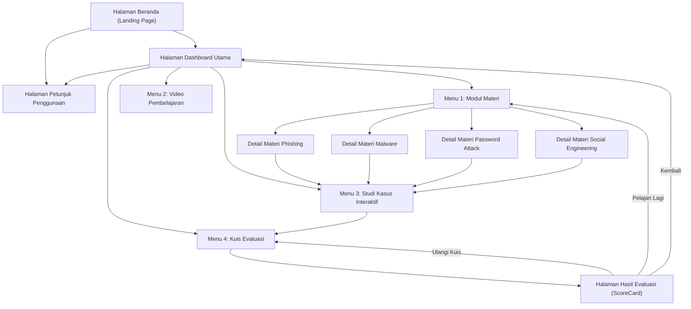

# STORYBOARD MULTIMEDIA PEMBELAJARAN INTERAKTIF
## WEBSITE "CYBERLEARN — MENGENAL ANCAMAN SIBER"

---

### A. IDENTITAS MEDIA PEMBELAJARAN

| Informasi | Keterangan |
| :--- | :--- |
| **Judul Media** | CyberLearn: Mengenal Ancaman Siber & Cara Melindungi Diri di Dunia Digital |
| **Mata Kuliah** | Multimedia Pembelajaran (Semester 5) |
| **Penyusun / Pengembang** | Naila Nursyifa Nasir |
| **Sasaran Pengguna** | Mahasiswa / Siswa / Pengguna Internet Pemula & Menengah |
| **Platform / Format** | Website Interaktif Responsif (Next.js, TypeScript, Tailwind CSS, Vercel) |
| **Karakteristik Media** | Berbasis Web, Multi-Elemen (Teks, Gambar Vektor, Audio Narasi Suara Asli, Sound Effect Interaktif, Video Pembelajaran, Studi Kasus Realistis, Kuis Evaluasi Otomatis) |

---

### B. DIAGRAM ALUR NAVIGASI (FLOWCHART SISTEM)

---

### C. TABEL STORYBOARD LENGKAP (FRAME BY FRAME)

---

#### **FRAME 01: Halaman Beranda (Landing Page / Hero Section)**

| Komponen | Deskripsi Rinci |
| :--- | :--- |
| **No. Frame / Layar** | **01 / BERANDA** |
| **Nama Halaman** | `Landing Page (app/page.tsx)` |
| **Tata Letak / Visual** | • Background gradasi cyber dark blue (`#17324D` ke `#0f2236`) dengan efek floating glow. • **Kiri**: Badge "MULTIMEDIA PEMBELAJARAN INTERAKTIF", Judul Besar "Mengenal Ancaman Siber", Subjudul cyan, deskripsi pengantar, attribution "Presented by Naila Nursyifa Nasir", tombol "MULAI BELAJAR" (gradasi cyan-blue) & "Petunjuk Penggunaan". • **Kanan**: Visual Stack 3 Kartu 3D Transparan (Perlindungan Data, Deteksi Dini Phishing, Keamanan Perangkat). • **Bawah**: Grid 5 kartu kartu Tujuan Pembelajaran. |
| **Teks & Konten** | • Judul: *"Mengenal Ancaman Siber — Cara Melindungi Diri di Dunia Digital"* • Deskripsi: *"Pelajari berbagai ancaman siber yang sering ditemukan di dunia digital dan cara sederhana untuk melindungi diri..."* • 5 Tujuan Pembelajaran: Definisi, Identifikasi Jenis, Karakteristik Modus, Tindakan Perlindungan Diri, Analisis Studi Kasus. |
| **Audio & SFX** | • **Narasi Suara Pembuka**: `/audio/intro.mp3` (autoplay/first-gesture) menyapa pengguna. • **SFX Klik**: `click.mp3` saat tombol "MULAI BELAJAR" atau "Petunjuk Penggunaan" ditekan. |
| **Interaktivitas / Event** | • Klik *"MULAI BELAJAR"* $\rightarrow$ Buka Halaman Dashboard (`/dashboard`). • Klik *"Petunjuk Penggunaan"* $\rightarrow$ Buka Halaman Petunjuk (`/petunjuk`). • Klik icon sound di Navbar $\rightarrow$ Toggle Sound ON/OFF. |

---

#### **FRAME 02: Halaman Petunjuk Penggunaan**

| Komponen | Deskripsi Rinci |
| :--- | :--- |
| **No. Frame / Layar** | **02 / PETUNJUK** |
| **Nama Halaman** | `Petunjuk Penggunaan (app/petunjuk/page.tsx)` |
| **Tata Letak / Visual** | • Header kartu putih dengan badge kuning *"Panduan Pengguna"*, judul halaman, dan tombol *"Kembali ke Dashboard"* di pojok kanan atas. • Kontainer utama grid 2 kolom berisi 8 langkah alur belajar bernomor 1–8 dengan ikon tematik. • Tombol aksi utama lebar di bagian bawah *"Saya Paham, Mulai Belajar Sekarang!"*. |
| **Teks & Konten** | 1. Mulai dari Dashboard. 2. Pilih menu Materi. 3. Pilih jenis ancaman (Phishing, Malware, Password Attack, Social Engineering). 4. Pelajari cara kerja, ciri-ciri & dengarkan narasi suara. 5. Lanjut ke menu Studi Kasus. 6. Jawab kasus & baca pembahasan feedback. 7. Kerjakan Kuis Evaluasi 10 soal. 8. Dapatkan hasil skor dan rekomendasi kelulusan. |
| **Audio & SFX** | • **SFX Klik**: `click.mp3` saat tombol kembali atau tombol mulai ditekan. |
| **Interaktivitas / Event** | • Klik *"Kembali ke Dashboard"* $\rightarrow$ Navigasi ke `/dashboard`. • Klik *"Saya Paham, Mulai Belajar Sekarang!"* $\rightarrow$ Navigasi ke `/dashboard`. |

---

#### **FRAME 03: Halaman Dashboard Utama & Progress Belajar**

| Komponen | Deskripsi Rinci |
| :--- | :--- |
| **No. Frame / Layar** | **03 / DASHBOARD** |
| **Nama Halaman** | `Dashboard Utama (app/dashboard/page.tsx)` |
| **Tata Letak / Visual** | • **Banner Atas**: Gradasi Biru Navy gelap, teks sambutan *"Mari Mulai Belajar! 👋"*, deskripsi singkat, tombol *"Kembali ke Beranda"*, dan **Kotak Nilai Kuis Terakhir** yang berada di tengah (mobile) atau di kanan (desktop). • **Bagian Progress Belajar**: 3 Progress Bar visual (Materi Dibaca %/4, Studi Kasus Selesai %/8, Hasil Kuis /100 Poin). • **Grid Menu Utama (4 Card)**: Card Petunjuk (Kuning), Card Materi (Biru), Card Video (Cyan), Card Kuis (Ungu). |
| **Teks & Konten** | • Header: *"DASHBOARD PEMBELAJARAN — Mari Mulai Belajar! 👋"* • Progress Bar: Data real-time tersimpan di LocalStorage browser pengguna. • 4 Pilihan Menu: 1. Petunjuk, 2. Materi, 3. Video Pembelajaran, 4. Kuis / Evaluasi. |
| **Audio & SFX** | • **SFX Navigasi**: `click.mp3` pada tombol navigasi beranda. • **SFX Seleksi**: `select.mp3` saat memilih salah satu dari 4 kartu menu utama. |
| **Interaktivitas / Event** | • Klik Card Petunjuk $\rightarrow$ `/petunjuk` • Klik Card Materi $\rightarrow$ `/materi` • Klik Card Video $\rightarrow$ `/video` • Klik Card Kuis $\rightarrow$ `/kuis` |

---

#### **FRAME 04: Halaman Menu Modul Materi (Overview)**

| Komponen | Deskripsi Rinci |
| :--- | :--- |
| **No. Frame / Layar** | **04 / MATERI OVERVIEW** |
| **Nama Halaman** | `Daftar Materi Ancaman Siber (app/materi/page.tsx)` |
| **Tata Letak / Visual** | • Banner putih atas: Badge *"Modul Pembelajaran"*, judul *"Kenali Ancaman Siber"*, definisi pengantar, tombol *"Kembali ke Dashboard"*. • Grid 2x2 responsif menampilkan 4 Threat Cards dengan ilustrasi visual 3D, icon badge warna-warni, deskripsi ringkas, dan tombol *"Pelajari Selengkapnya →"*. |
| **Teks & Konten** | 1. **Phishing** (Warna Biru) — Penipuan manipulasi tautan/pesan palsu. 2. **Malware** (Warna Merah) — Perangkat lunak berbahaya perusak sistem. 3. **Password Attack** (Warna Ungu) — Percobaan peretasan kata sandi & sniffing. 4. **Social Engineering** (Warna Amber) — Manipulasi psikologis manusia. |
| **Audio & SFX** | • **SFX Klik**: `click.mp3` pada tombol kembali. • **SFX Seleksi**: `select.mp3` pada saat memilih kartu materi apapun. |
| **Interaktivitas / Event** | • Klik kartu materi $\rightarrow$ masuk ke halaman detail masing-masing (`/materi/phishing`, `/materi/malware`, `/materi/password-attack`, `/materi/social-engineering`). |

---

#### **FRAME 05: Halaman Detail Materi (Phishing, Malware, Password Attack, Social Engineering)**

| Komponen | Deskripsi Rinci |
| :--- | :--- |
| **No. Frame / Layar** | **05 / DETAIL MATERI** |
| **Nama Halaman** | `Template Detail Ancaman (components/ThreatDetailTemplate.tsx)` |
| **Tata Letak / Visual** | • **Header Card**: Gambar ilustrasi ancaman di kiri, badge *"DETAIL MATERI"*, judul besar ancaman siber, tombol *"Kembali ke Materi"* dan *"Studi Kasus [Nama Materi]"*. • **Audio Player Box**: Pemutar audio suara penjelasan dengan status visual play/pause/wave. • **Section 1**: 2 Kolom (Card "Apa itu?" & Card "Bagaimana Cara Kerjanya?" bernomor alur). • **Section 2**: 2 Kolom (Card "Ciri-ciri Utama" & Card Gelap "Contoh Skenario Dunia Nyata"). • **Section 3 (Hijau Emerald)**: Card "Cara Melindungi Diri" berisi checklist proteksi. • **Footer Navigation**: Tombol *"Kembali ke Daftar Materi"* & *"Uji Pemahaman Studi Kasus →"*. |
| **Teks & Konten** | • Konten materi lengkap terstruktur dari `data/materials.ts` (Definisi, Alur Kerja 4 langkah, Ciri-ciri, Skenario Nyata, dan 4 Langkah Proteksi). |
| **Audio & SFX** | • **Audio Narasi Penjelasan**: Suara MP3 penjelasan per topik (`phising.mp3`, `malware.mp3`, `PasswordAttack.mp3`, `SosialEngineering.mp3`) dengan fallback otomatis Text-to-Speech bahasa Indonesia. • **SFX Play/Click**: `play.mp3` saat narasi diputar, `click.mp3` saat jeda/berhenti. |
| **Interaktivitas / Event** | • Klik Tombol Play Audio $\rightarrow$ Putar rekaman suara materi. • Klik *"Studi Kasus"* $\rightarrow$ Langsung menuju latihan kasus kategori terkait (`/studi-kasus?category=...`). • Otomatis menambah progress materi dibaca di dashboard. |

---

#### **FRAME 06: Halaman Video Pembelajaran**

| Komponen | Deskripsi Rinci |
| :--- | :--- |
| **No. Frame / Layar** | **06 / VIDEO** |
| **Nama Halaman** | `Video Pembelajaran (app/video/page.tsx)` |
| **Tata Letak / Visual** | • **Kiri / Area Utama (2 Kolom)**: Frame pemutar video YouTube interaktif responsif 16:9, kartu deskripsi video aktif, badge durasi, dan link *"Buka di YouTube"*. • **Kanan / Playlist (1 Kolom)**: Daftar 5 video pembelajaran dengan penomoran `01`–`05`, durasi waktu, judul, dan status aktif (highlight biru). |
| **Teks & Konten** | • Video 1: Mengenal Jenis Ancaman Siber & Keamanan Informasi (10:15) • Video 2: Phishing: Kenali dan Hindari Penipuannya (01:38) • Video 3: Malware dan Cara Melindungi Perangkat (01:41) • Video 4: Password Attack dan Keamanan Kata Sandi (01:17) • Video 5: Social Engineering: Waspada Manipulasi (02:19) |
| **Audio & SFX** | • **SFX Playlist**: `select.mp3` saat memilih video dari daftar. • **Voice Prompt Assist**: Web Speech API menyebutkan urutan dan judul video yang dipilih. |
| **Interaktivitas / Event** | • Klik salah satu playlist $\rightarrow$ Video YouTube langsung berganti secara mulus tanpa reload halaman. |

---

#### **FRAME 07: Halaman Studi Kasus Interaktif**

| Komponen | Deskripsi Rinci |
| :--- | :--- |
| **No. Frame / Layar** | **07 / STUDI KASUS** |
| **Nama Halaman** | `Latihan Kasus Interaktif (app/studi-kasus/page.tsx)` |
| **Tata Letak / Visual** | • **Header Banner**: Badge *"Latihan Analisis Mandiri"*, judul halaman, counter *"X / 8 Kasus Diselesaikan"*, tombol *"Dashboard"*. • **Filter Tab**: Kategori filter horizontal (*Semua Kasus, Phishing, Malware, Password Attack, Social Engineering*). • **Daftar Kartu Kasus**: Box skenario kasus nyata, 4 tombol opsi pilihan tindakan A, B, C, D, tombol *"Kirim Jawaban"*. • **Panel Feedback Interaktif**: Kotak penjelasan evaluasi yang muncul seketika setelah menjawab (Hijau jika Benar, Amber/Kuning jika Salah) lengkap dengan Tips Keamanan Khusus. • **Banner Ajakan Kuis Bawah**: Banner biru ajakan menuju kuis evaluasi akhir. |
| **Teks & Konten** | • 8 Skenario Kasus Dunia Nyata (2 Phishing, 2 Malware, 2 Password Attack, 2 Social Engineering). • Penjelasan mendalam kenapa jawaban salah/benar dan tips pencegahan spesifik pilihan pengguna. |
| **Audio & SFX** | • **SFX Tab Filter**: `select.mp3` saat ganti kategori. • **SFX Jawaban Benar**: `/audio/benar.mp3` (suara feedback apresiasi). • **SFX Jawaban Salah**: `/audio/salah.mp3` (suara feedback peringatan lembut). • **SFX Coba Lagi**: `click.mp3` saat mengulang kasus. |
| **Interaktivitas / Event** | • Memilih Opsi A/B/C/D $\rightarrow$ Highlight opsi aktif. • Klik *"Kirim Jawaban"* $\rightarrow$ Evaluasi otomatis, mainkan suara feedback, kunci pilihan, dan tampilkan kartu pembahasan komprehensif. • Menambah progress kasus selesai di LocalStorage. |

---

#### **FRAME 08: Halaman Kuis / Evaluasi (Mode Pengerjaan)**

| Komponen | Deskripsi Rinci |
| :--- | :--- |
| **No. Frame / Layar** | **08 / KUIS EVALUASI** |
| **Nama Halaman** | `Kuis Evaluasi Keamanan Siber (app/kuis/page.tsx)` |
| **Tata Letak / Visual** | • **Sebelum Mulai**: Card informasi aturan kuis (10 soal pilihan ganda, 1 jawaban benar, hasil di akhir) dan tombol besar *"Mulai Kuis"*. • **Saat Mengerjakan**:  &nbsp;&nbsp;1. Header Counter: Badge *"Kuis Evaluasi"* & *"Soal X dari 10"*. &nbsp;&nbsp;2. Animated Progress Bar garis biru di atas soal. &nbsp;&nbsp;3. Teks Pertanyaan Tebal. &nbsp;&nbsp;4. List 4 Pilihan Opsi Jawaban vertikal dengan radio indicator bulat. &nbsp;&nbsp;5. Tombol *"Soal Selanjutnya →"* / *"Lihat Hasil Evaluasi 🎉"*. |
| **Teks & Konten** | • 10 butir soal pilihan ganda menguji seluruh materi (Definisi Siber, Phishing, Ransomware, Password Attack/Brute Force, Social Engineering, Password Kuat, 2FA, Pencegahan Malware, Bahaya OTP, Prinsip Zero Trust). |
| **Audio & SFX** | • **Background Music Kuis**: `/audio/musik kuis.mp3` (volume santai loop 35%). • **SFX Mulai**: `click.mp3`. • **SFX Pilih Jawaban**: `select.mp3` saat mengklik opsi. • **SFX Ganti Soal**: `click.mp3` saat menekan Soal Selanjutnya. |
| **Interaktivitas / Event** | • Memilih Opsi $\rightarrow$ Highlight biru, aktifkan tombol next. • Klik Next $\rightarrow$ Simpan jawaban, geser nomor soal, perbarui bar progress. • Pada soal ke-10 $\rightarrow$ Hitung skor otomatis $\rightarrow$ Beralih ke Frame 09. |

---

#### **FRAME 09: Halaman Hasil Evaluasi (ScoreCard)**

| Komponen | Deskripsi Rinci |
| :--- | :--- |
| **No. Frame / Layar** | **09 / HASIL EVALUASI** |
| **Nama Halaman** | `ScoreCard Component (components/ScoreCard.tsx & app/hasil/page.tsx)` |
| **Tata Letak / Visual** | • Card putih besar melayang di tengah layar dengan animasi Zoom-in. • **Trophy Icon**: Badge Piala Emas dengan label *"LULUS"* (jika $\ge 75$) atau *"REMEDIAL"* (jika $< 75$). • **Animasi Confetti**: Efek kembang api warna-warni bertebaran di layar jika skor $\ge 75$. • **Box Nilai Akhir**: Angka nilai besar (contoh: `90`), counter jawaban benar `X dari 10 soal`. • **Feedback Badge & Kalimat Motivasi**: Penilaian kualitatif (Sangat Baik / Sudah Baik / Cukup Baik / Perlu Latihan). • **3 Tombol Aksi**: *"Ulangi Kuis"*, *"Pelajari Materi Lagi"*, dan *"Kembali ke Dashboard"*. |
| **Teks & Konten** | • Nilai: `0` – `100` Poin. • Contoh Feedback: *"Pemahamanmu tentang keamanan siber sangat baik. Kamu telah menguasai konsep ancaman dan cara pencegahannya dengan sempurna!"* • Pesan suara personal ucapan selamat. |
| **Audio & SFX** | • **SFX Selesai / Menang**: `complete.mp3` / `/audio/menang.mp3` saat hasil terbuka. • **Voice Congratulations**: Web Speech API membacakan ucapan selamat berdasarkan perolehan nilai. • **SFX Klik Tombol**: `click.mp3` saat memilih tombol aksi. |
| **Interaktivitas / Event** | • Klik *"Ulangi Kuis"* $\rightarrow$ Reset kuis dari soal nomor 1. • Klik *"Pelajari Materi Lagi"* $\rightarrow$ Buka `/materi`. • Klik *"Kembali ke Dashboard"* $\rightarrow$ Buka `/dashboard` dengan nilai terbaru ter-update. |

---

### D. SPESIFIKASI ASSET AUDIO & SOUND EFFECT

| Nama File | Path | Fungsi / Trigger | Volume |
| :--- | :--- | :--- | :--- |
| `intro.mp3` | `/public/audio/intro.mp3` | Narasi suara pembuka sambutan di Halaman Beranda | 100% |
| `phising.mp3.mp3` | `/public/audio/phising.mp3.mp3` | Audio narasi penjelasan materi Phishing | 100% |
| `malware.mp3.mp3` | `/public/audio/malware.mp3.mp3` | Audio narasi penjelasan materi Malware | 100% |
| `PasswordAttack.mp3.mp3` | `/public/audio/PasswordAttack.mp3.mp3` | Audio narasi penjelasan materi Password Attack | 100% |
| `SosialEngineering.mp3.mp3` | `/public/audio/SosialEngineering.mp3.mp3` | Audio narasi penjelasan materi Social Engineering | 100% |
| `click.mp3` | `/public/audio/click.mp3` | Feedback klik tombol biasa, navbar, tombol kembali | 30% |
| `select.mp3` | `/public/audio/select.mp3` | Feedback memilih card menu, opsi jawaban, playlist video, tab filter | 28% |
| `play.mp3` | `/public/audio/play.mp3` | Feedback menekan tombol dengarkan narasi | 32% |
| `benar.mp3` | `/public/audio/benar.mp3` | Feedback audio jawaban benar pada studi kasus | 50% |
| `salah.mp3` | `/public/audio/salah.mp3` | Feedback audio jawaban salah pada studi kasus | 50% |
| `musik kuis.mp3` | `/public/audio/musik kuis.mp3` | Backsound instrumen suasana mengerjakan kuis | 35% (Loop) |
| `complete.mp3` | `/public/audio/complete.mp3` | Sound effect perayaan saat hasil evaluasi kuis selesai | 42% |
